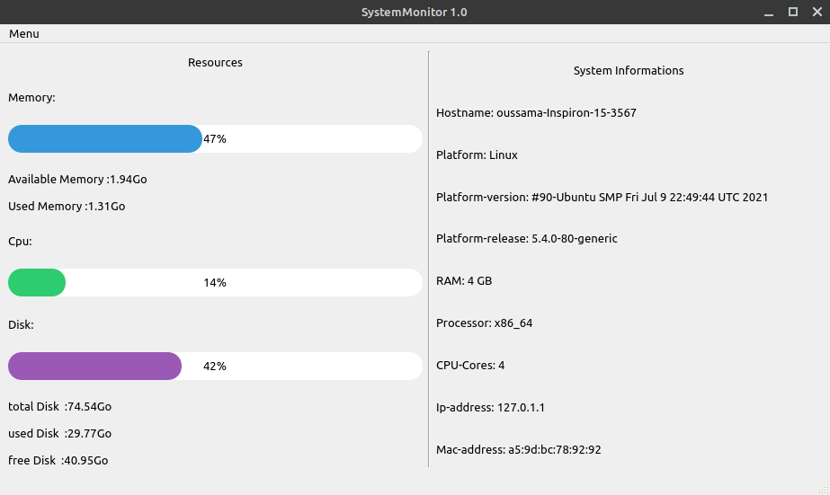

# SystemMonitor
Python GUI program to monitor ram and cpu usage along with disk usage.
<p>
  
  
  
  
  
  

  
  
  
</p>
## Screenshot

### Prerequisites

Install psutil module;a cross-platform lib for process and system monitoring in Python and
Install Pyqt5 module to run the GUI.
```
pip install psutil
```
```
pip install PyQt5
```
## Usage
In your terminal navigate to the program directory and type:
```
python SystemMonitor.py
```
To run the GUI:
```
python main.py
```
## Contributing
Pull requests are welcome. For major changes, please open an issue first to discuss what you would like to change.

## License
[MIT](https://choosealicense.com/licenses/mit/)
