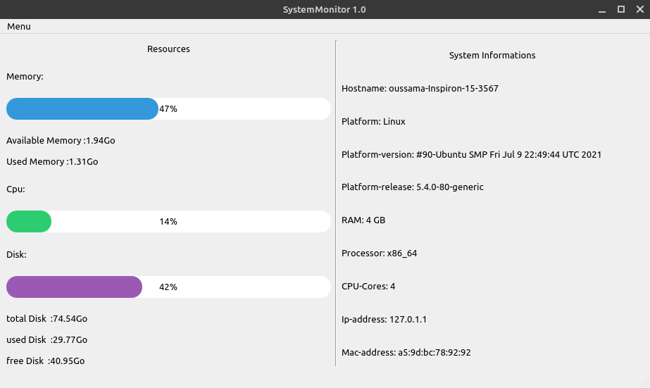

# SystemMonitor
<b>Simple python GUI program to monitor ram and cpu usage along with disk usage.</b>
<p>
  
  
  
  
  
  

  
  
  
</p>



### Prerequisites

install modules:

```
pip install -r requirements.txt
```

## Usage

install project files:

```
git clone https://github.com/Oussama1403/SystemMonitor
```

Run the GUI

```
python src/gui/main.py
```

Run a no-gui script file

```
python src/scripts/SystemMonitor.py
```
## Contributing

Pull requests are welcome. For major changes, please open an issue first to discuss what you would like to change.

## License
[MIT](https://choosealicense.com/licenses/mit/)
